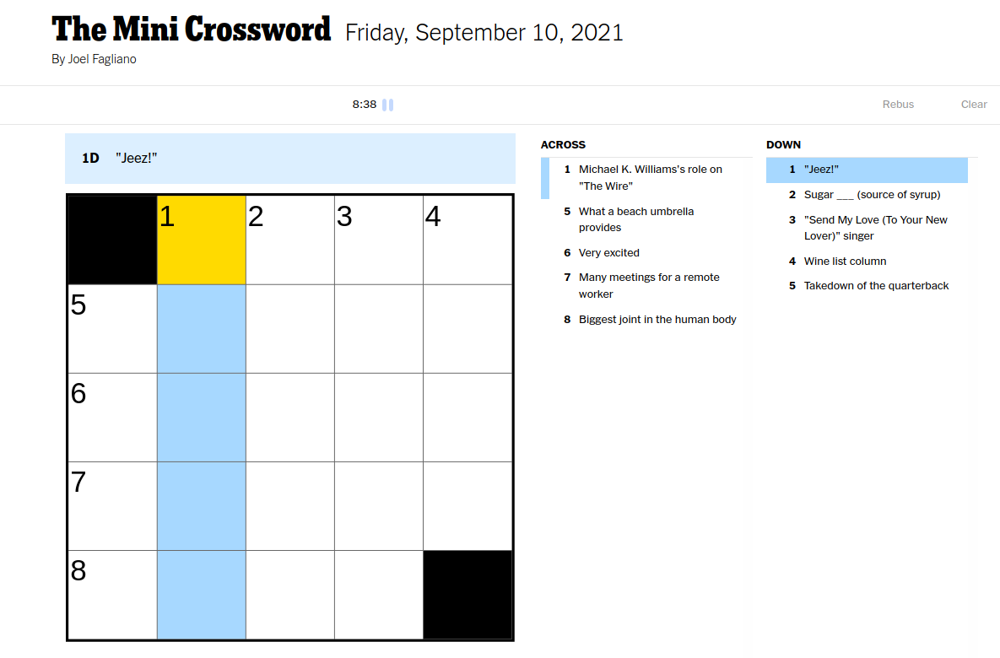

# Web Scraping with Python

## Purpose
---
This project is a data scraping project with python.Data has become the most important thing in today's world.The rapid increase in its importance has made it important to obtain data.Therefore, data scraping is one of the fastest and most important ways to obtain data.

Within the scope of this project, it will be from the puzzle game [The Mini Crossword from the game page of the New York Times](https://www.nytimes.com/crosswords/game/mini) data scraping will be done and then data scraping will be done and then clues for the puzzle will be extracted from the data obtained.

## Built With

* [BeautifulSoup](https://www.crummy.com/software/BeautifulSoup/bs4/doc/)
* [Requests](https://docs.python-requests.org/en/master/)

----
 
## Prerequisites

We must have the libraries needed:

Library | install | version
--- | --- | ---
*BeautifulSoup* | `pip install beautifulsoup4` | **4.10.0**
*Requests* | `pip install requests` | **2.26.0**

---
## How to install and run
First download the repo to your own computer
		
		git clone https://github.com/Mertozturkk/btcwozm1.git

Then Open the terminal over the file extension you downloaded and run the code:

        python3 btcwozm1.py

---
